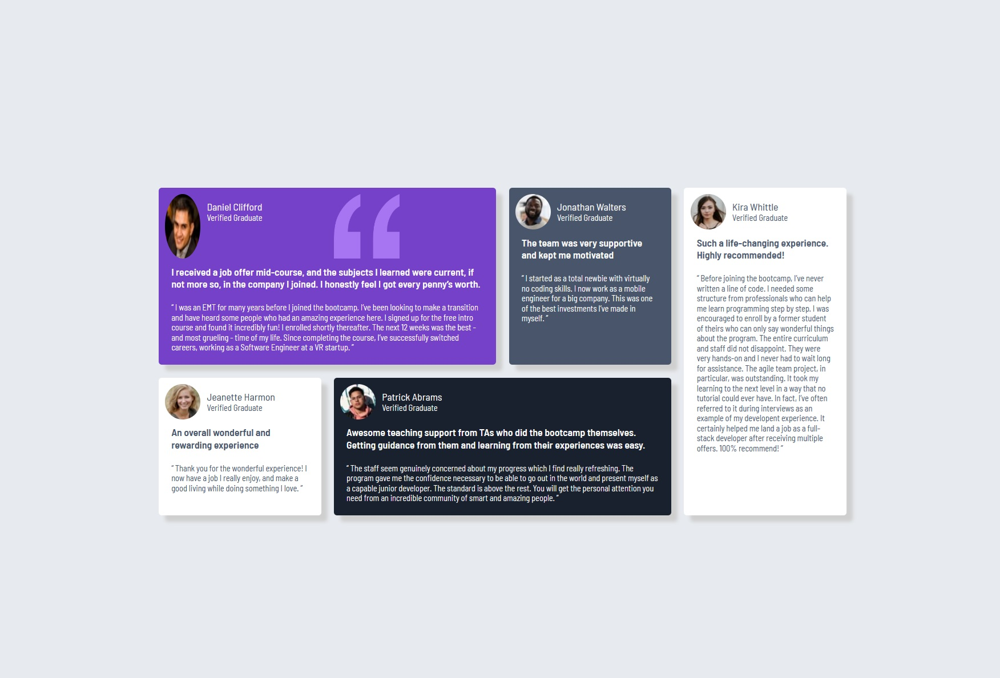

# Frontend Mentor - Testimonial Frontend

I built the Testimonial Card component based on the design provided by Frontend Mentor challenges. 

## Table of contents

- [Overview](#overview)
  - [Screenshot](#screenshot)
  - [Links](#links)
- [My process](#my-process)
  - [Built with](#built-with)

## Overview

### Screenshot

> Desktop Design:

> Mobile Design:

### Links

- Live Site URL: [Live site URL](https://mahi-mani.github.io/Testimonial-Frontend/)

## My process

### Built with

- Semantic HTML5 markup
- CSS custom properties
- CSS Grid
